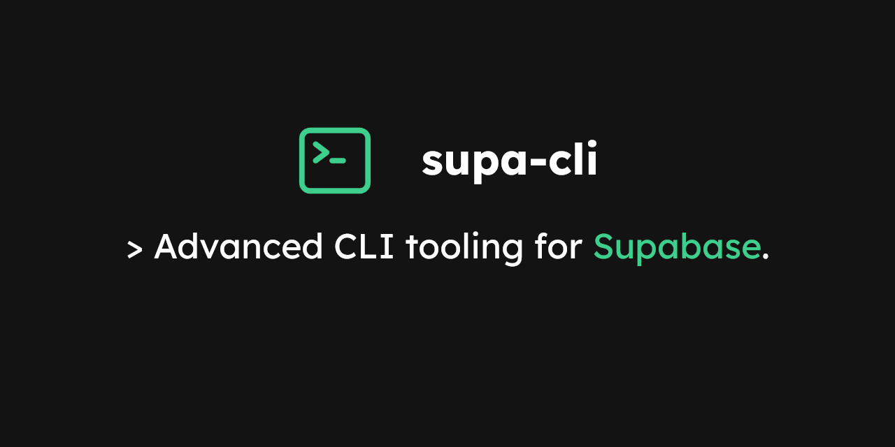

# @actcoding/supa-cli

> Advanced CLI tooling for Supabase.

This project provides an [`artisan`](https://laravel.com/docs/artisan)-like experience
for [Supabase](https://supabase.com/) projects.

We're also collecting all the experience we've had with Supabase projects in the past within this repository.

## Documentation

https://actcoding.github.io/supa-cli/

## Features

- TypeScript migrations and seeders using [node-pg-migrate](https://github.com/salsita/node-pg-migrate)
- Email templates using [MJML](https://mjml.io/)
- Auth debugging

## Todo

- i18n for emails
- tests
- use something other than `commander.js`

## License

[MIT](LICENSE)
